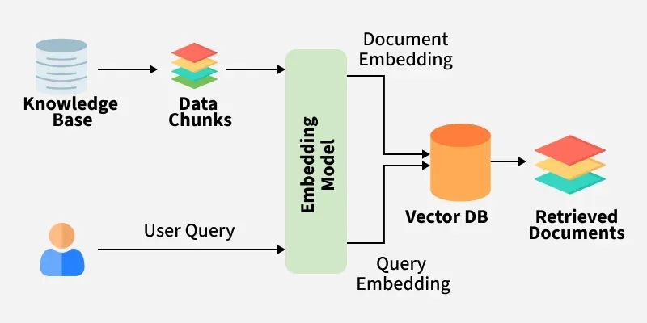

## Python LangGraph Tutorial ##
LangGraph is a framework that let us build AI agents as graphs, where each node does a task and each edges decides what happens next.

## Installation ##
Enable virtual environment
```
Command: Set-ExecutionPolicy -ExecutionPolicy RemoteSigned -Scope Process -Force
& .\.venv\Scripts\Activate.ps1

Alternative Command: .venv\Scripts\activate.bat

```

pip install langgraph langchain-core langchain_openai langchain_community

### Elements of LangGraph ###

1. **State:** It is shared data structure that holds the current information or context of the entire application.
2. **Nodes:** Nodes are individual functions or operations that perform specific task within the graph
3. **Edges:** Edges are connection between nodes that determines the flow of execution.
4. **Conditional Edges:** Specialized connections taht decide the next node to execute.
5. **START:** virtual entry point in LangGraph, making where the workflow begins.
6. **END:** Signifies the concludion of the workflow in LangGraph.
7. **Tools:** Specialized functions or utilites that nodes can utilize to perform specific tasks such as fetching data from API.
8. **ToolNode:** Special kind of node whose main job is to run a tool. It connects the tools output in the state whcih will be used by another state.
9. **StateGraph:** class in LangGraph used to build the workflow.
10. **Runnable:** fundamental building blocks, allowing for us to create modular system.


**Types of Messages:**

1. Human Message: Represents a input from user
2. AI Message: Represents a responses generated by AI models
3. Function Message: Represents the response of a function call
4. Tool Message: Similar to function messages but specific for a tool
5. System Message: Used to provide instructions or context to the model

**Topics Covered:**
1. Simple Node Graph:
    The simple node graph illustrates the basic of LangGraph. 
2. Multi Node Graph:
    This is multiple sequential nodes in a graph.
3. Conditional Node Graph:
    
4. Loop Concept in Lang Graph:

5. Simple AI Bot
    - Define state structure with a list of HumanMessages object
    - Initialize the Lama3 with OpenAI lama
    - Sending and handling different types of messages
    - Building and Compiling the graph of an Agent

```
    ollama pull llama3.1
    pip install -U langchain-ollama
```

After this setup, we can create llm by the following code:

```
from langchain_ollama import ChatOllama
llm = ChatOllama(
    model="llama3.1:latest", 
    validate_model_on_init = True,
    temperature = 0.8,
    num_predict = 256,
)
```
6. ReAct Agent (Reacting and Reasoning Agent):
    - Learn how to create Tools in LangGraph
    - How to create ReAct Graph
    - Work with different types of Messages such as ToolMessages
    - Test out roboustness of our graph

7. Drafter Agent
8. RAG

    Retrieval Augmented Generation is the innovative approach in the field of natural language processing (NLP) that combines the strengths of the retrieval-based and generation based model to enhance the quality of the generated text.

    How does Retrieval Augmented Generation work?
    

    The system first searches external sources for relevant information based on the user's query instead of relying only on the existing training data.


    We have downloaded the mxbai-embed-large from mixedbread.ai
    Following command is used to download the embedding model

```
ollama pull mxbai-embed-large
 ```

    Basic example of initializing the model as:

```
import ollama

response = ollama.embeddings(
    model='mxbai-embed-large',
    prompt='Represent this sentence for searching       relevant passages: The sky is blue because of Rayleigh scattering'
    )

print(response)
```